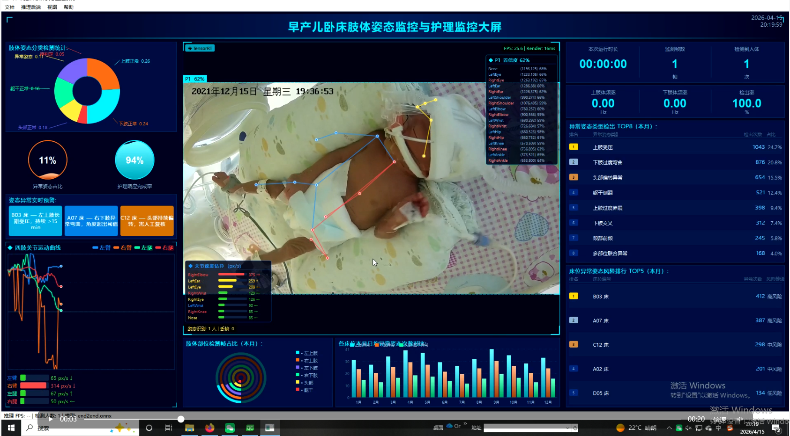

# HospitalDashboard

> 早产儿卧床肢体姿态监控与护理系统 — 基于 Qt6 + CUDA + ONNX Runtime / TensorRT 的实时医疗大屏看板

## 功能展示
### 效果图
  # 相对路径：从readme.md所在位置，进入figures文件夹找demo2.png

## 目录

- [功能简介](#功能简介)
- [截图预览](#截图预览)
- [依赖环境](#依赖环境)
- [构建方法](#构建方法)
- [运行方式](#运行方式)
- [项目结构](#项目结构)
- [模块说明](#模块说明)
- [配置说明](#配置说明)
- [许可证](#许可证)

---

## 功能简介

HospitalDashboard 是一套面向 NICU（新生儿重症监护病房）的实时监控大屏系统，核心能力包括：

- **实时姿态检测**：通过摄像头采集画面，利用 ONNX Runtime 或 NVIDIA TensorRT 后端对早产儿四肢关键点进行推理，输出骨架叠加可视化结果。
- **肢体运动曲线**：对各肢体运动幅度进行时序分析，绘制实时折线图，辅助护理人员发现异常。
- **KPI 统计面板**：展示今日 / 本月的异常次数、护理次数、床位占用率等关键指标。
- **风险预警列表**：实时滚动显示最新告警信息，支持异常姿态 TOP 榜与床位风险 TOP 榜。
- **多种图表组件**：饼图、甜甜圈图、仪表盘、条形图一体集成，样式统一，适配暗色医疗大屏主题。
- **SQLite 数据持久化**：姿态检测结果自动写入本地数据库，支持历史回溯与统计分析。

---

## 截图预览

> 截图放置于 `figures/` 目录，构建成功后可参考。

---

## 依赖环境

| 依赖项 | 最低版本 | 说明 |
|---|---|---|
| CMake | 3.18 | 构建系统 |
| Qt | 6.5 | Core / Widgets / Gui / Multimedia / MultimediaWidgets / Charts / Sql |
| CUDA Toolkit | 11.8+ | GPU 加速推理（`CUDA::cudart`） |
| ONNX Runtime | 1.16+ | 可选，ONNX 后端推理 |
| TensorRT | 10.x | 可选，TensorRT 后端推理（更高性能） |
| C++ 编译器 | C++17 | MSVC 2019+ / GCC 11+ / Clang 14+ |

> **注意**：ONNX Runtime 与 TensorRT 均为可选依赖。若二者均未配置，程序以 Stub 模式运行（无实际推理，仅展示 UI 与静态数据）。

---

## 构建方法

### 1. 克隆仓库

```bash
git clone https://github.com/your-username/HospitalDashboard.git
cd HospitalDashboard
```

### 2. 配置 CMake

```bash
cmake -B build \
  -DCMAKE_BUILD_TYPE=Release \
  -DQt6_DIR="E:/Qt/6.5.3/msvc2019_64/lib/cmake/Qt6" \
  -DONNXRUNTIME_DIR="/path/to/onnxruntime" \
  -DTENSORRT_DIR="/path/to/TensorRT"
```

- `-DQt6_DIR`：指向 Qt6 CMake 配置目录，**必须**设置。
- `-DONNXRUNTIME_DIR`：ONNX Runtime 安装根目录（含 `include/` 与 `lib/`），可选。
- `-DTENSORRT_DIR`：TensorRT 安装根目录，可选；若同时设置两者，运行时可动态切换后端。

### 3. 编译

```bash
cmake --build build --config Release -j8
```

### 4. 安装（可选）

```bash
cmake --install build --prefix ./install
```

---

## 运行方式

```bash
./build/HospitalDashboard
```

首次运行将在程序目录下自动创建 SQLite 数据库文件 `pose_data.db`，用于存储检测历史。

---

## 项目结构

```
HospitalDashboard/
├── CMakeLists.txt              # 顶层构建脚本
├── main.cpp                    # 程序入口
├── MainWindow.h                # 转发包含头（避免 ODR 冲突）
├── MainWindow.cpp              # 主窗口实现
├── MainWindow_Standard.h       # 主窗口类定义（唯一权威版本）
│
├── widgets/                    # UI 组件层
│   ├── DashboardWidget         # 根布局，组合所有子面板
│   ├── DetectionDisplayWidget  # 视频流 + 检测结果叠加显示
│   ├── LimbMotionWidget        # 四肢运动幅度时序曲线
│   ├── KpiWidget               # KPI 统计卡片
│   ├── GaugeWidget             # 仪表盘（异常率 / 护理率）
│   ├── PieChartWidget          # 饼图
│   ├── DonutChartWidget        # 甜甜圈图
│   ├── BarChartWidget          # 条形图
│   ├── TopListWidget           # TOP 榜列表
│   ├── AlertWidget             # 预警滚动列表
│   └── TitleBarWidget          # 顶部标题栏
│
├── detector/                   # 推理后端层
│   ├── DetectorBase.h          # 抽象基类接口
│   ├── OnnxDetector            # ONNX Runtime 后端
│   ├── TensorRTDetector        # TensorRT 后端
│   ├── DetectorManager         # 后端管理 + 工作线程调度
│   ├── PoseDetector            # 姿态关键点检测封装
│   ├── PoseDetectorManager     # 姿态检测器管理
│   ├── PoseResult.h            # 检测结果数据结构
│   ├── PoseOverlayWidget.h     # 骨架叠加渲染
│   └── MotionAnalyzer          # 运动幅度分析
│
├── database/                   # 数据持久化层
│   └── PoseDatabase            # SQLite 读写封装
│
├── resources/                  # Qt 资源文件
│   └── resources.qrc
│
└── figures/                    # 说明文档配图与视频
    └── video.mp4               # 演示视频
```

---

## 模块说明

### DetectorManager

封装了 ONNX / TensorRT 双后端，采用**工作线程 + Drop-Frame 策略**：若上一帧仍在推理，新帧直接丢弃，保证 UI 不卡顿。

```cpp
DetectorManager* mgr = new DetectorManager(this);
mgr->setBackend(DetectorManager::Backend::TensorRT);
mgr->init("yolo.onnx", "coco.txt");
connect(mgr, &DetectorManager::detectionReady, this, &MyWidget::onDetections);
mgr->submitFrame(frame);  // 每帧调用
```

### DashboardWidget

主界面根组件，内部通过 `QGridLayout` 将所有子面板排布为参考大屏布局，对外暴露两个接入点：

```cpp
detectionPanel()   // 接入视频流与检测结果信号
limbMotionPanel()  // 接入运动曲线数据信号
```

### PoseDatabase

封装了基于 Qt SQL 的 SQLite 读写，自动建表，支持批量写入检测帧结果，并提供按时间范围的历史查询接口。

---

## 配置说明

| CMake 变量 | 类型 | 默认值 | 说明 |
|---|---|---|---|
| `Qt6_DIR` | PATH | — | Qt6 CMake 配置路径（**必填**） |
| `ONNXRUNTIME_DIR` | PATH | 空 | ONNX Runtime 安装目录（可选） |
| `TENSORRT_DIR` | PATH | 空 | TensorRT 安装目录（可选） |

启用推理后端后，CMake 会自动添加对应的编译宏（`HAVE_ONNXRUNTIME` / `HAVE_TENSORRT`），代码中通过 `#ifdef` 条件编译切换实现。

---

## 许可证

本项目暂未指定开源许可证，所有权归原作者所有。如需使用或二次开发，请联系作者获得授权。
